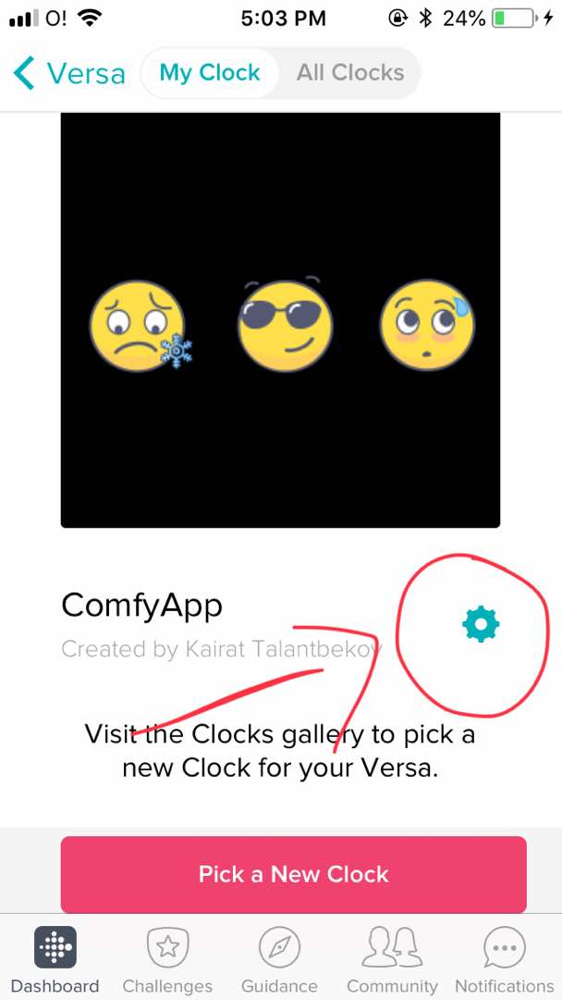
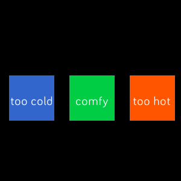

[](http://www.budslab.org/)

# Colaborating using git and fitbit

1. first ensure that you have the latest nodejs installation https://nodejs.org/en/
2. clone the repo `git clone git@github.com:buds-lab/fitbit-hotorcold-app.git`
3. `cd fitbit-hotcold-app`
4. `npm install`

### Building and installing

1. `npx fitbit-build` will build the project
2. `npx fitbit` opens the browser, and logs into your fitbit account. From here you can connect to devices and install the app


# Project structure
— This guide explains the underlying structure of current and other Fitbit applications, and how the various elements are related. [dev.fitbit.com/build/guides/application/](https://dev.fitbit.com/build/guides/application/)
— To get started with ClockFace development or to launch project read more at [Fitbit Developer Website](https://dev.fitbit.com/getting-started/). 


Supported Devices: Ionic, Versa, Versa-Lite
The app is available by the link. To install ClockFace follow the link https://gam.fitbit.com/gallery/clock/731497ca-5e7c-4383-a702-18330587d048 on your phone, it will redirect to FitBit app gallery.

# Document structure saved in InfluxDB

```python
{
"startFeedback":"2019-11-22T01:57:14.342Z",  # Timestamp when the user started the survey (i.e. pressed one of the two buttons in the clock face)
"heartRate":60,  # heart rate measured when the user completed the survey
"voteLog":40,  # counter which stores information on how many times the user completed the survey, used for debugging to check that no responses where lost
"comfort":10,  # Clock face question, 10 = "Comfy", 9 = "Not Comfy" 
"indoorOutdoor":11,  # Location, 9 = "Outdoor", 11 = "Indoor",
"change": 10, # Change location, activity or clothing, 11 = "Yes Change", 10 = "No Change"
"location": 10, # Where are you, 8 = "Portable", 9 = "Work", 10 = "Other", 11 = "Home"
"thermal":9,  # Thermal preference, 9 = "Warmer", 10 = "No Change", 11 = "Cooler"
"light":9,  # Light preference, 9 = "Brighter", 10 = "No Change", 11 = "Dimmer"
"noise":9,  # Noise preference, 9 = "Louder", 10 = "No Change", 11 = "Quiter"
"clothing":11,  # Clothing, 8="very light", 9 = "Light", 10 = "Medium", 11 = "Heavy"
"met":11,  # Metabolic rate, 8="resting", 9 = "sitting", 10 = "standing", 11 = "exercising"
"air-vel":11,  # Perceived air movement, 9 = "Not Perceived", 11 = "Perceived"
"mood":11,  # Mood, 9 = "Sad", 10 = "Neutral", 11 = "Happy"
"responseSpeed":2.577,  # Time in seconds it took to complete the survey
"endFeedback":"2019-11-22T01:57:16.919Z",  # Timestamp when the user completed the survey
"lat":48.13194,"lon":11.54944,  # Latitude and longitude provided by the GPS of the phone
"setLocation":True,
"bodyPresence":True, # passes information whether the user is wearing the watch or not
"user_id":"debug",  # User ID as per selection in settings
"experiment_id":"debug",  # Experiment ID as per selection in settings
}
```

# Install  ClockFace to your own Fitbit Versa

— The app is available only by the link for now. To install ClockFace follow the link [https://gam.fitbit.com/gallery/clock/731497ca-5e7c-4383-a702-18330587d048](https://gam.fitbit.com/gallery/clock/731497ca-5e7c-4383-a702-18330587d048) on your phone, it will redirect to FitBit app gallery.

— In order to send data to the server from the FitBit device:
- the watch should be connected to the phone via Bluetooth and the phone should have the internet
- If Responses made without connection to the mobile phone, data will be saved locally on Fitbit device memory and will be sent to the server when the user respond next time with phone and internet connection.
- To track user id user should log in first in settings of the clock face. As shown below.




— If you want to get records from the server:
- Time stored in UTC, it should be converted
- To get CSV go to [http://54.169.153.174:7070](http://54.169.153.174:7070)
- It is possible to get JSON, but the data format might be different. In order to get JSON, go to [http://54.169.153.174:7070/test](http://54.169.153.174:7070/test) and right mouse click and chose "Save as".

# Screenshot


# To run the project on your computer (windows)
  - Create a Fitbit account. [Sign up here](https://www.fitbit.com/signup).
  - Install Fitbit OS Simulator for [Windows](https://simulator-updates.fitbit.com/download/latest/win)
  - Create an empty project in [Fitbit Studio](https://studio.fitbit.com/projects).
  - Download current repository files and add all files to the newly created project in Fitbit Studio
  - Launch **OS Simulator**, connect to simulator from **Fitbit Studio**, and launch the project from **Fitbit Studio**
  - Also you need to update FitBit app clientId and clientSecret in "settings/indexjsx" file
# Good to know about fibit device/companion API
--- How to make device listen for http request from the server.  [here](https://community.fitbit.com/t5/SDK-Development/How-to-make-device-listen-for-http-request-from-the-server/td-p/2963102)
--- clock.ontick doesn't happen when the display is off. Use setTimeout.
--- To send request to the server use HTTPS endpoint.

https://github.com/gedankenstuecke/Minimal-Clock was used as a starter template.

