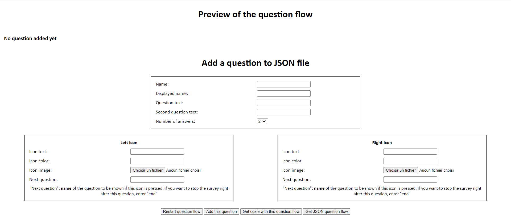
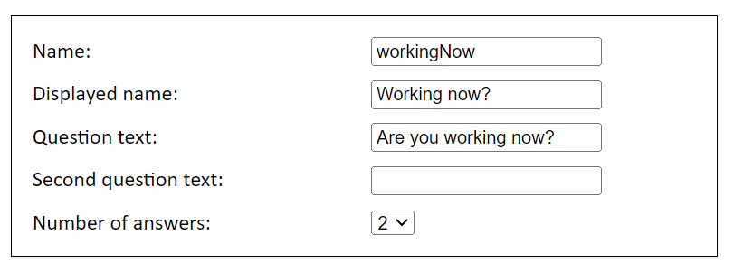
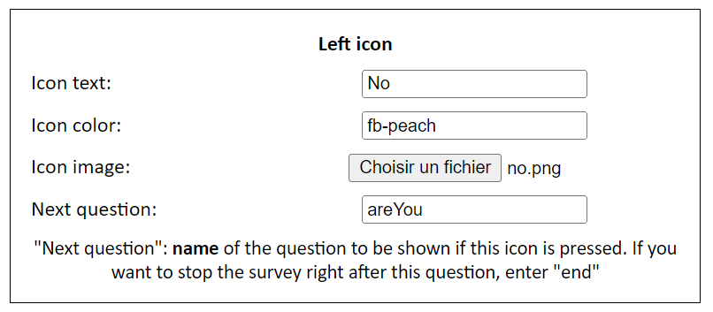
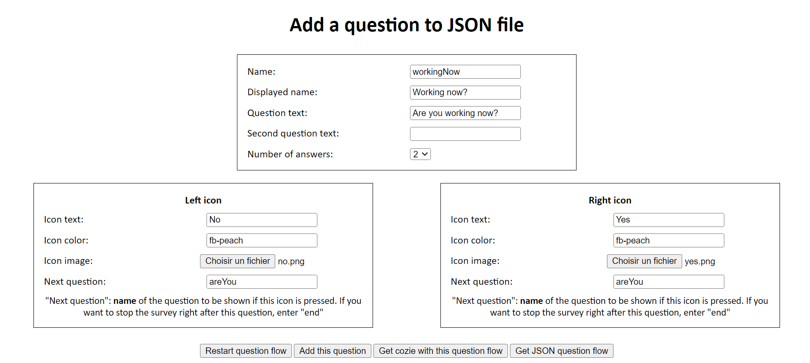

## Introduction

In this section, you will learn how to create a question that you will add to your question flow. Here is the interface as you may find it at the beginning:

As you may have noticed, there are several sections:

- Preview of the question flow: this section, detailed [here](question-flow-preview.md), will display, as it will be printed on the watch, all the questions you already added to the question flow.
- Add a question to JSON file: this section allows you to fill out the details of the next question you will add. First, you will fill in the details of the question itself. Then, you will type in the details for each answer.

## Question details

First, let's focus on the question details section:

You can notice on this screenshot that this section includes 5 fields:

- Name: this is the name of the question. This field must not contain any sepcial caracter or space
- Displayed name: this field is used in the companion settings (depending on the version of cozie, this feature might not be implemented anymore).
- Question text: this field refers to the first line of the question that is printed on the watch. Make sure that this field length remains under 45 characters.
- Second question text: this field is optionnal and should be used if the length of your question text is more than 45 characters. The value of this field is printed right below the previous field on the watch.
- Number of answers: this field allows you to choose the number of answers of your question. This number remains between 2 and 4. If you change this field, the section below will automatically change and display all the field that has to be filled in, depending on the number of answers you chose.

## Answers details

Now that the question details has been correctly filled in, you will have to fill in every answer's details. Depending on the number of answers, you will have to do this 2, 3 or 4 times. Here is an answer details section:

Here is an example for the left answer. In this section, you can find 4 fields:

- Icon text: this field's value will be printed right below the icon of the answer.
- Icon color: this field refers to the icon's background color of the answer. The value of this field can be an hexadecimal RGB value (e.g. #00b0b9) or a fitbit color ([here](https://dev.fitbit.com/build/guides/user-interface/css/#web-color-names) is a list of the available fitbit colors).
- Icon image: this field allows you to upload an image in your computer that will be the icon of the answer.
- Next question: this field is of paramount importance. The value of this field is the name of the next question (the first field you fill out in the question details section) to be shown if the user chooses this answer. If you want this answer to stop the survey, you may want to type in "end" in this field.

Eventually, you will have to fill in this section for every answer of the question.

## Add your question

Once every section explained above has been correctly filled in, the interface may be more or less like this (for a 2-answers question):

Take a minute to check all fields and then you can easily add this question to your question flow by clicking on the <strong>Add this question</strong> button.

Eventually, you will be redirected to the same page and you will be able to add as many questions as you like.