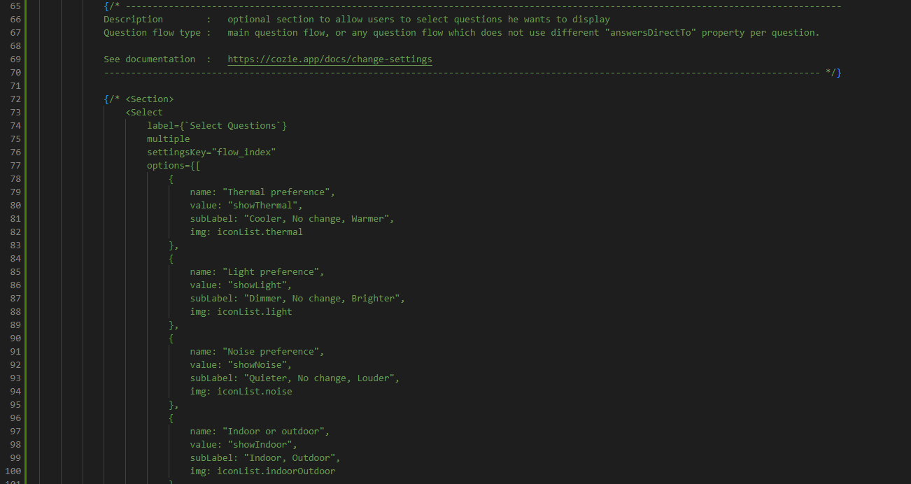
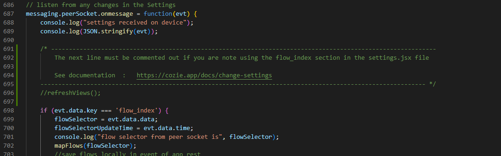
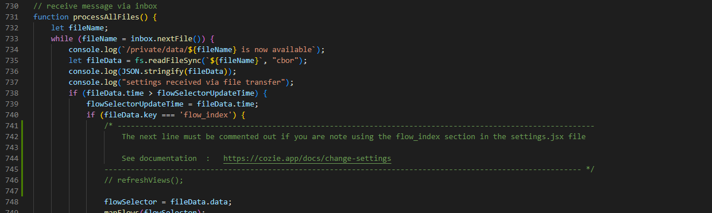

## Introduction

In this section, you will understand how to set up the "Select Question" settings available in the companion app.

As you may have noticed in the documentation videos you could find in the previous sections, a feature has previously been developped to allow users to choose which questions has to be shown on the clockface for a specific type of question flow.

This feature has been deleted because of consistency issues with the new question flow type (which allows developers to redirect the user to a specific question after a specific answer). However, here is a way to bring this feature back if you are using the question flow type that does not redirect the user to different next questions depending on the answer (e.g. main-flow.json).

## Changes in the code

In order to bring this feature back, you need to change those 2 files:

- index.jsx in the settings folder: you need to uncomment the following section.

- index.js in the app folder: you need to uncomment the following sections.

These lines will call the function refreshFlow. This function automatically refreshes the "allViews" array to keep the selected questions only.

