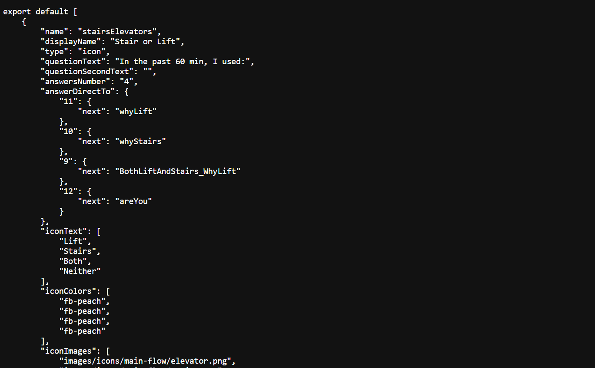

## Introduction

Once you created all your questions, two possibilities are available:

- Generate your question flow JSON file: this will only generate the question flow as a JSON file that fits with the implementation of cozie for Fitbit.
- [Generate your cozie](generate-cozie.md): this will generate cozie with your own question flow. You will be able to download it as a zip-file.

## Generate the JSON file

By clicking on the <strong>Generate JSON question flow</strong>, you will be redirected to the JSON file.



Then you can easily copy all this document and paste it into the ```main-flow.json``` file that you can find at this path ```path-to-cozie-folder/resources/flows/main-flow.json```.

## Build and install cozie

Now that you changed the question flow, here is the steps to follow to build and install your new version of cozie:

- Download a version of cozie form github:
```
git init
git clone git@github.com:cozie-app/cozie.git
```

- Download the icons into this folder ```path-to-cozie-folder/resources/images/icons/main-flow```. This step is required if you chose to generate the JSON file only. This step is automatically done when you choose to [generate cozie](generate-cozie.md).

- Install npm in your cozie folder:
```
npm install
```
(You don't need to worry about errors generated by this command)

- Log in into your Fitbit account. Then, build and install cozie on your Fitbit OS Simulator:
```
npx fitbit
fitbit$ build-and-install
```

Then, your cozie has been successfully built with your own question flow.