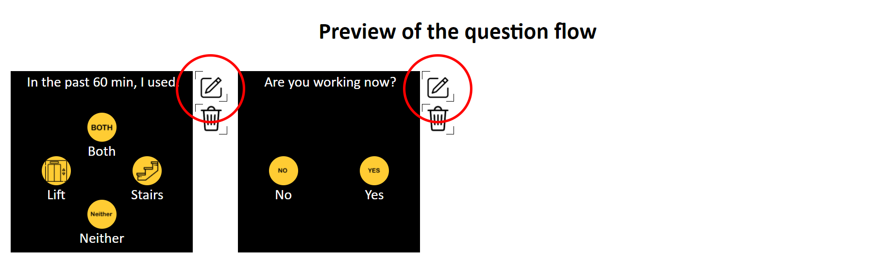
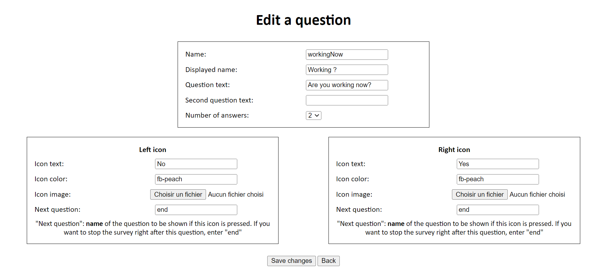

## Edit a question

In order to avoid mistakes you could have done by filling out your questions, an edit button has been implemented.

By clicking on one of these button, you will be redirected to this interface and you will easily be able to edit a specific question:

As you can see, this interface is quite similar to the usual interface that allows you to add a question, except that all fields value has been set to the value you filled in before. You may have noticed that the icon image's fields are empty.
<strong>If you want to change the image displayed on a specific answer, you can upload another file, but if you don't want to change it, you can leave this field empty.</strong>

## Save your changes

If you make any changes, you need to save these changes by clicking the <strong>Save changes</strong> button. Otherwise, you can click on the <strong>Back</strong> button. Those two buttons will redirect you to the usual interface.