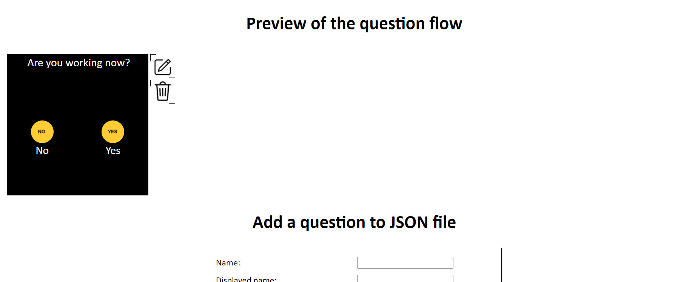

## Preview section

Now that you created your first question, you can find a preview of this question in the <strong>Preview of the question flow</strong> section. Here is the example generated by the previous page:

For each question you will add to your question flow, this clockface preview will be added to the preview section, and you can also find 2 buttons per question:

- Edit question: this button allows you to edit a specific question. You can find more details about how to edit a question [here](modify-questions.md).
- Delete question: by clicking on this button, you will erase the question of your question flow. You may be careful with this button because you will not be able to undo this.